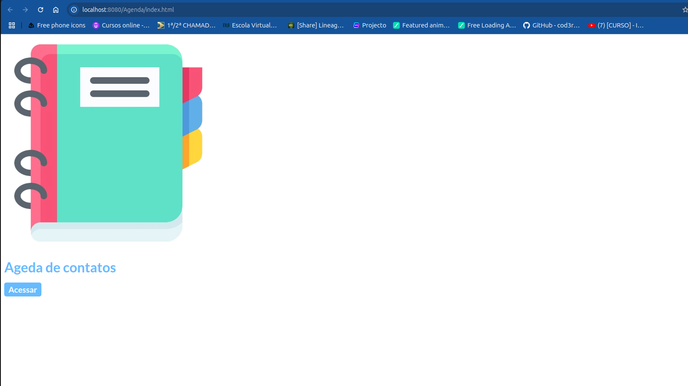

# Java_Web_Agenda

Documetação do projeto 
<a href="https://github.com/LeoTerryMaster/Java_Web_Agenda/tree/main/Agenda/doc">Documentação</a>

 
<h1></h1>
 

   <h1> Desenvolvimento:</h1>
    <ul>
        <li>Java 19</li>
        <li>Tomcat 9</li>
        <li>MariaDB</li>
        <li>iTexPdf</li>
        <li>Html /Css /Js</li>
    </ul>
     
    <h1></h1>
    <ol>
    <li>Criar contato</li>
    <li>Editar contato</li>
    <li>Excluir contato</li>
    <li>Relatório em pdf dos contato</li>
    </ol>

 
<h1></h1>
Boas práticas de programação.
 
<h1></h1>